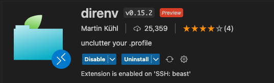
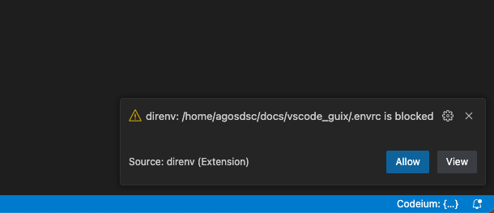
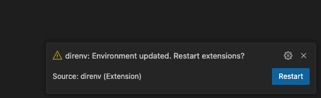
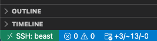
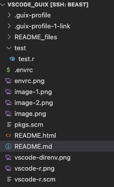
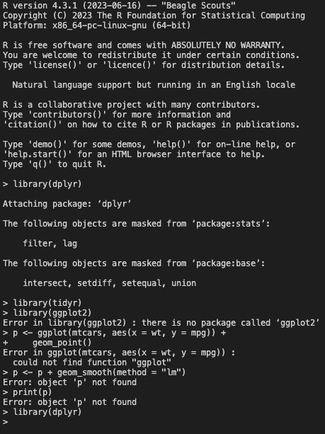

## Using R via vscode and guix

Prerequisites:
- [Guix](https://guix.gnu.org/)
- [Vscode](https://code.visualstudio.com/)
- [direnv](https://direnv.net/)

### Idea

For this setup we are going to use [vscode](https://code.visualstudio.com/) as our IDE and [Guix](https://guix.gnu.org/) to manage project-related software-environments. 
We are interfacing the two using a vscode extension to allow integrating [direnv](https://direnv.net/), which can update Environment Variables in our shell on a project-by-project basis.


### Install Extensions

- install [vscode r extension](https://marketplace.visualstudio.com/items?itemName=REditorSupport.r) 

[](https://marketplace.visualstudio.com/items?itemName=REditorSupport.r)

- Install [vscode direnv extension](https://marketplace.visualstudio.com/items?itemName=mkhl.direnv) 

[](https://marketplace.visualstudio.com/items?itemName=mkhl.direnv)

### Setup

Save `vscode-r.scm` as a baseline manifest for R that allows smooth integration with vscode: 

```scheme
(specifications->manifest
  (list "r-minimal"

        ;; base packages
        "bash-minimal"
        "glibc-locales"
        "nss-certs"

        ;; Common command line tools lest the container is too empty.
        "coreutils"
        "grep"
        "which"
        "wget"
        "sed"
        "git"
        "fd"
        "ripgrep"
        "direnv"

        ;; R markdown tools
        "pandoc"

        ;; Toolchain and common libraries for "install.packages"
        "gcc-toolchain@10"
        "gfortran-toolchain"
        "gawk"
        "tar"
        "gzip"
        "unzip"
        "make"
        "cmake"
        "pkg-config"
        "cairo"
        "libxt"
        "openssl"
        "curl"
        "zlib"

        ;; vscode dependencies
        "r-lintr"
        "r-styler"
        "r-languageserver"
        "r-httpgd"

        ))
```

Save any additional packages in `pkgs.scm`: 

```scheme
(specifications->manifest
  (list "r-dplyr"
        "r-readr"
        "r-tidyr"
        "r-purrr"
        "r-forcats"
        ))
```

Save a minimal `.envrc` configuration file: 

```sh
## this is required to create and load a guix profile in the current directory
GUIX_PROFILE="$PWD/.guix-profile"
eval $(guix package -p "$GUIX_PROFILE"  -m vscode-r.scm -m pkgs.scm)
eval $(guix package -p "$GUIX_PROFILE" --search-paths)

## this is required to have guix and common tools (less, man etc.) in PATH 
PATH="/bin:/usr/bin:/gnu/remote/bin:$PATH" 
```


Reload the vscode workspace. There should be a popup asking you to allow the loading of the .envrc file. Click `Allow``




Another popup will ask you to restart extensions. Click `Restart`



Now, on the left side of the status bar you should see the following:



which indicates that the .envrc file has been loaded and some environment variables are changed.

You  may also notice that a guix profile has been created in the current directory.




Now we can try using R in vscode. Please open the `test.R` file in the `test` folder and run the lines using `cmd/ctrl+enter`.


<details><summary>Click here to see the output: </summary> 




**Hah! The ggplot2 package has been missing.**

Lets install it by adding `r-ggplot2` to the `pkgs.scm` file.

Wait until direnv has updated the environment variables and retry the same command.

<details><summary> Show me the output: </summary>

**Uh! Still does not work.**

Yes, you first have to restart the R session, because the absolute guix profile has changed.

If you want to install packages without reloading the session, you may use the [guix.install](https://cran.r-project.org/web/packages/guix.install/index.html) R package (guix name: `r-guix-install`). You can install packages into the currently loaded profile by using 
```r
guix.install("r-ggplot2", profile = Sys.getenv("GUIX_PROFILE"))
```
</details>


